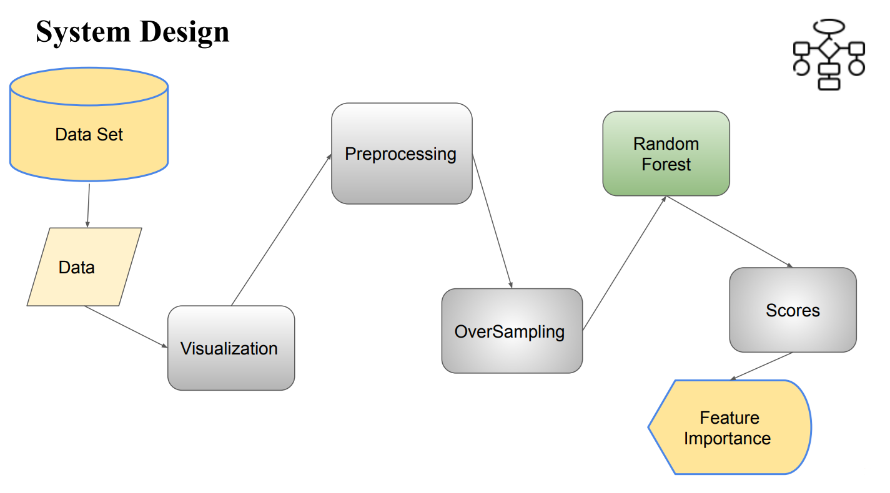

# PREDICTIVE ANALYSIS ON HOSPITAL READMISSION

## Abstract
Hospital Re-admission is an episode where a patient, after being discharged from a hospital, is admitted again within a specific time frame. Hospital re-admission rates are often used as a key outcome measure in health services and are considered a quality benchmark for health systems.

This project aims to explore the factors that influence re-admission and build a predictive model using machine learning techniques, utilizing a dataset with limited features. The model's performance is assessed using metrics such as accuracy, precision, recall, and AUC. Additionally, the feature importance highlights the major factors contributing to re-admission.

## Introduction
Hospital re-admission occurs when a patient, discharged from the hospital, is re-admitted within a defined period. Readmission rates for specific conditions have become indicators of hospital quality and negatively impact healthcare costs.

To address this issue, the Centers for Medicare & Medicaid Services established the Hospital Readmissions Reduction Program, which aims to enhance patient care while reducing healthcare costs. Predicting re-admission and understanding the contributing factors can help hospitals save money and improve the quality of care.

## Problem Statement
This project applies simple machine learning techniques to healthcare data to uncover strong predictors of hospital re-admission. The goal is to evaluate how well we can predict readmission using a dataset with limited features.

## Objectives
- Develop a machine learning algorithm to predict hospital re-admission.
- Check the model's accuracy and optimize it for better performance.
- Identify the factors that contribute to hospital re-admission.

## Scope
The study focuses on implementing machine learning techniques to predict hospital re-admission using a limited dataset. The restricted number of records and features limits the model's application. Patient health and data variety also contribute to the model's limitations.

## Technology Review

### Random Forest
Random Forest is an ensemble learning method that builds multiple decision trees and merges them for more accurate and stable predictions. The model was trained using Random Forest in two distinct methods.

## System Requirements

### Hardware Requirements
- **CPU**: 2 x 64-bit
- **Network**: Local server (localhost:8888)
- **RAM**: 32 GB or 16 GB
- **HDD**: 100 GB or 300 GB

### Software Requirements
- **OS**: Windows 8 or newer, Kernel
- **IDE**: Jupyter (Anaconda)
- **SDK**: Python (Installed)

## System Design



- **Data Set**: Dataset used for the model
- **Data Visualization**: Used for initial analysis
- **Preprocessing**: Addressing missing data, oversampling with SMOTE
- **Random Forest**: Trained the model using Random Forest
- **Feature Importance**: Identified key factors affecting re-admission

## Implementation

The following libraries were used:
```python
import pandas as pd
import matplotlib.pyplot as plt
import seaborn as sns
from sklearn.model_selection import train_test_split
from imblearn.over_sampling import SMOTE
from collections import Counter
from sklearn.ensemble import RandomForestClassifier
from sklearn.metrics import accuracy_score, precision_score, recall_score, roc_auc_score
```

## Testing & Results
The model was trained using two different methods.

### Method 1 (Substitution of Categorial Variables):
- Accuracy: 0.88
- Precision: 0.90
- Recall: 0.83
- AUC: 0.87


### Method 2 (Dummies of Categorial Variables):
- Accuracy: 0.89
- Precision: 0.91
- Recall: 0.87
- AUC: 0.89


## Conclusion
Machine Learning techniques, such as Random Forest, were used to analyze the dataset with limited features. Key factors affecting readmission include:

- Age: Older patients are more likely to be re-admitted due to health and immunity decline.
- Number_inpatient: Length of stay in the hospital affects readmission likelihood.
- Time_in_hospital: Duration of hospitalization also plays a role.
- Medications and Procedures: The number of medications and procedures can impact the chances of readmission.

There are still many techniques to explore, parameters to refine, and features to select. The dataset could be complemented with external information for improvement.

## Contributions by
Laxmi Priya Kasi
Nithisha Akkinepally
